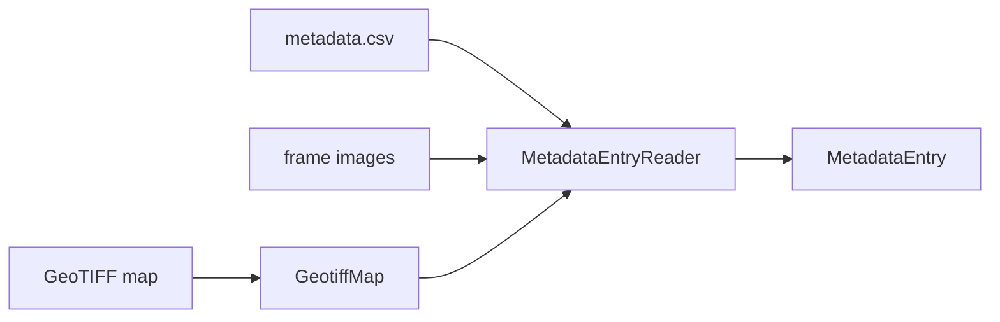
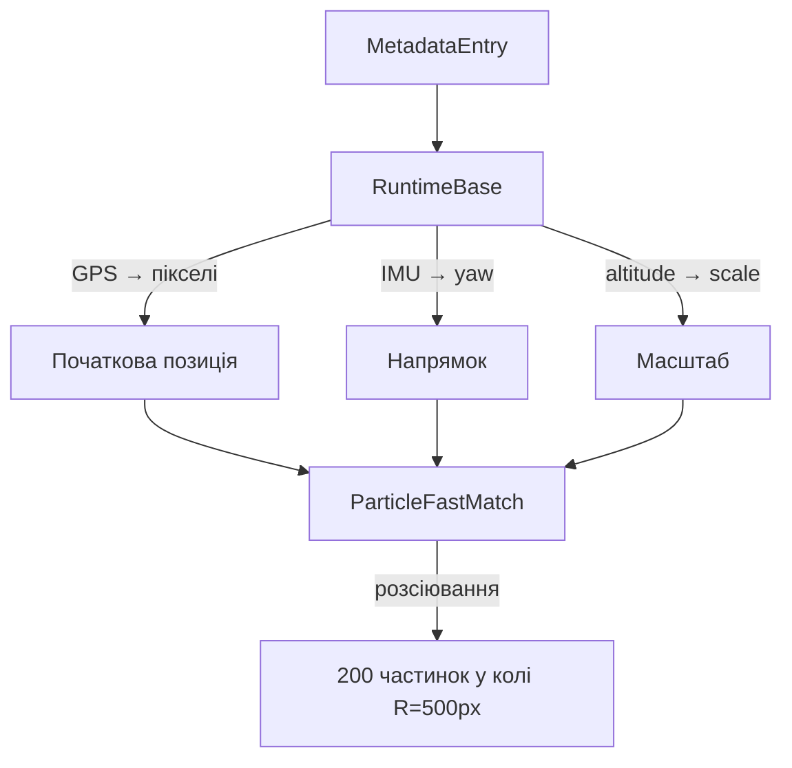
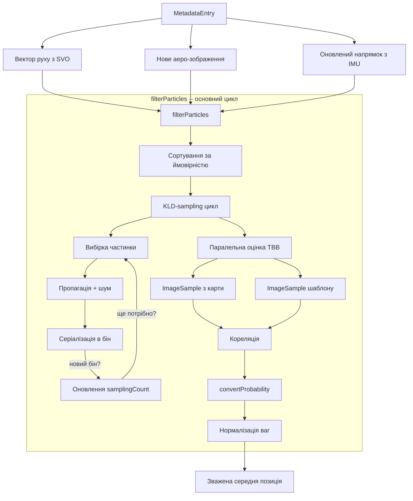
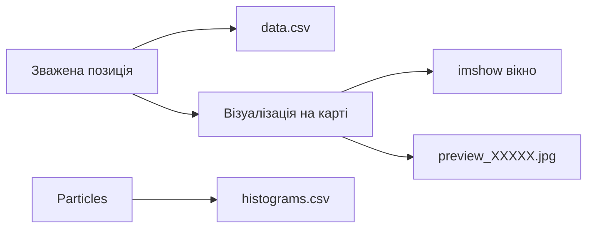

# Архітектура системи

## Загальна схема

Система складається з трьох шарів: **зчитування даних**, **алгоритм локалізації** та **управління/вивід**.

```
┌─────────────────────────────────────────────────────────────────────┐
│                         dataset-test.cpp                            │
│                     (CLI, цикл обробки кадрів)                      │
└──────────────────────────────┬──────────────────────────────────────┘
                               │
                               ▼
┌─────────────────────────────────────────────────────────────────────┐
│                    RuntimeBase                           │
│              (оркестрація, візуалізація, результати)                 │
├─────────────────────┬───────────────────────────────────────────────┤
│                     │                                               │
│    Зчитування       │              Алгоритм                         │
│    даних            │              локалізації                       │
│                     │                                               │
│  ┌───────────────┐  │  ┌──────────────────────────────────────────┐ │
│  │MetadataEntry  │  │  │         ParticleFastMatch                │ │
│  │  EntryReader  │──┼─▶│  ┌────────────┐  ┌───────────────────┐  │ │
│  └───────┬───────┘  │  │  │ Particles  │  │   ImageSample     │  │ │
│          │          │  │  │ ┌────────┐ │  │ (швидка кореляція) │  │ │
│  ┌───────▼───────┐  │  │  │ │Particle│ │  └───────────────────┘  │ │
│  │  GeotiffMap   │  │  │  │ │ (x,y)  │ │                        │ │
│  │  (GDAL/UTM)   │  │  │  │ └────────┘ │  ┌───────────────────┐ │ │
│  └───────────────┘  │  │  └────────────┘  │   Utilities       │ │ │
│                     │  │                   │ (кореляція, шум,  │ │ │
│  ┌───────────────┐  │  │  ┌────────────┐  │  афінні матриці)  │ │ │
│  │ MetadataEntry │  │  │  │ FAsTMatch  │  └───────────────────┘ │ │
│  │ (GPS, IMU,    │  │  │  │ (базовий)  │                        │ │
│  │  зображення)  │  │  │  └────────────┘                        │ │
│  └───────────────┘  │  └──────────────────────────────────────────┘ │
└─────────────────────┴───────────────────────────────────────────────┘
```

## Потік даних

### 1. Завантаження



`MetadataEntryReader` відкриває директорію набору даних, парсить CSV-заголовки та послідовно видає `MetadataEntry` об'єкти. Кожен entry містить: зображення з камери, GPS, IMU-кватерніон, SVO-позицію, ground truth, та посилання на карту.

### 2. Ініціалізація (перший кадр)



`RuntimeBase::initialize` створює `ParticleFastMatch` з початковою GPS-позицією, конвертованою в піксельні координати через `GeotiffMap::toPixels`. 200 частинок розподіляються в гаусівському колі радіусом 500 пікселів.

### 3. Цикл оновлення (кожний наступний кадр)



### 4. Оцінка однієї частинки (деталі)

```
Частинка (x, y) + напрямок + масштаб
        │
        ▼
mapTransformation() → матриця обертання 2x3
        │
        ▼
ImageSample(карта, samplingPoints, матриця, позиція)
        │  Для кожної точки семплювання:
        │  1. Зміщення точки на позицію частинки
        │  2. Трансформація через матрицю обертання
        │  3. Зчитування пікселя з карти
        │  4. Нормалізація по середньому
        │
        ▼
calcSimilarity(templateSample, mapSample)
        │  Σ(templ[i] * map[i]) / (std_templ * std_map)
        │
        ▼
convertProbability(correlation)
        │  HPRELU / GLF / Softmax
        │
        ▼
particle.setProbability(prob)  // ковзне середнє за 5 кадрів
```

### 5. Вивід результатів



## Взаємодія компонентів

### Залежності між класами

```
dataset-test.cpp
    ├── MetadataEntryReader
    │   ├── MetadataEntry
    │   │   ├── Quaternion
    │   │   ├── Vector3d
    │   │   └── Map (shared_ptr)
    │   └── GeotiffMap (→ Map)
    │       └── GeographicLib::GeoCoords
    │
    └── RuntimeBase (abstract)
        ├── WorkspaceRuntime (GUI)
        │   └── PreviewRenderer (RenderContext)
        ├── HeadlessRuntime (CSV only)
        ├── ParticleFilterCore
        │   └── ParticleFastMatch (→ FAsTMatch)
        │       ├── Particles (composition over vector<Particle>)
        │       │   └── Particle (shared_ptr<ParticleConfig>)
        │       │       └── MatchConfig (FAsT-Match)
        │       ├── ImageSample
        │       ├── Utilities (static)
        │       ├── AffineTransformation
        │       ├── ConfigExpanderBase
        │       │   └── GridConfigExpander
        │       ├── ConfigVisualizer
        │       └── MatchNet (FAsT-Match)
        ├── MotionModelSvo (→ SvoMovementResult)
        ├── ScaleModel
        ├── ResultWriter (static)
        └── GeographicLib::LocalCartesian
```

### Потік володіння (ownership)

```
RuntimeBase
    │
    ├── ParticleFilterCore core_
    │   │
    │   └── shared_ptr<ParticleFastMatch> pfm
    │       │
    │       └── Particles particles (value, contains vector<Particle>)
    │           │
    │           ├── shared_ptr<ParticleConfig> particleConfig (спільна конфігурація)
    │           └── shared_ptr<vector<float>> s_initial (спільний масштаб)
    │               (кожна Particle тримає копію shared_ptr)
    │
    ├── MotionModelSvo motionModel_ (value)
    ├── ScaleModel scaleModel_ (value)
    └── shared_ptr<LocalCartesian> svoCoordinates_

MetadataEntryReader
    │
    └── GeoMapPtr map (shared_ptr<GeotiffMap>)
        (передається в кожен MetadataEntry через shared_ptr<Map>)
```

## Паралелізм

Система використовує Intel TBB для паралельної обробки:

| Місце | Виклик TBB | Що паралелізується |
|-------|------------|-------------------|
| `ParticleFastMatch::filterParticles` | `tbb::parallel_for_each` | Оцінка кожної частинки (ImageSample + кореляція) |
| `ParticleFastMatch::evaluateConfigs` | `tbb::parallel_for` | Обчислення відстані для кожної афінної конфігурації |
| `ParticleFastMatch::configsToAffine` | `tbb::parallel_for` | Конвертація конфігурацій в матриці + перевірка меж |
| `Utilities::configsToAffine` | `tbb::parallel_for` | Аналогічно |

Потокобезпечність забезпечується тим, що кожен паралельний виклик працює з незалежними даними (різні частинки/конфігурації).

## Конфігурація алгоритму

```
Параметри з CLI (ParticleFilterConfig, валідуються при ініціалізації):
    startLocation  = GPS → пікселі
    radius         = 500 px (--particle-radius)
    epsilon        = 0.1    (--epsilon)    → no_of_points = 10/(0.1²) = 1000
    particleCount  = 200    (--particle-count)
    quantile       = 0.99   (--quantile)   → zvalue з ztable
    kld_error      = 0.5    (--kld-error)
    binSize        = 5 px   (--bin-size)
    use_gaussian   = true   (--use-gaussian)

Інші параметри з CLI:
    correlation-bound  → lowBound (поріг активації)
    conversion-method  → HPRELU / GLF / Softmax
    skip-rate          → пропуск кадрів (за замовчуванням 10)

Масштаб (динамічний):
    scale = tan(hfov/2) * altitude / (imageWidth/2)
    діапазон: [0.9*scale, 1.1*scale], 5 кроків
```
